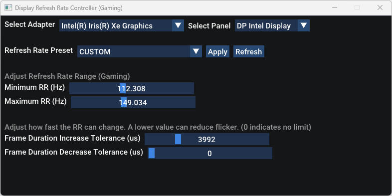

# Display Refresh Rate Controller

Display Refresh Rate Controller is a utility designed to dynamically manage display refresh rates. It shows the
currently applied RR settings and provides options to apply supported RR presets by platform and panel. A custom mode is
also supported to change each setting individually.

### Key Features

* Refresh rate adjustment for fluid visuals during gaming.
* User-friendly GUI for customizing settings and profiles.
* Compatibility with a wide range of monitors and display technologies.

### Supported Platforms

* Intel
    * All Gen 12 iGPUs
    * All Gen 13 iGPUs
    * All Intel Arc dGPUs
* Nvidia - Not Supported
* AMD - Not Supported

### Technologies

C++, MFC, GPU APIs, System APIs

### Usage

1. Clone the repository to your local machine.
2. Build the Refresh Rate Controller application.
3. Launch the application and customize settings to suit your preferences.

### Contributing

We welcome contributions! Feel free to fork the repository, make your improvements, and submit a pull request. Please
adhere to our contribution guidelines.
